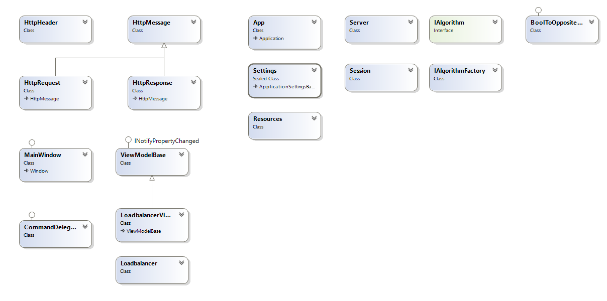
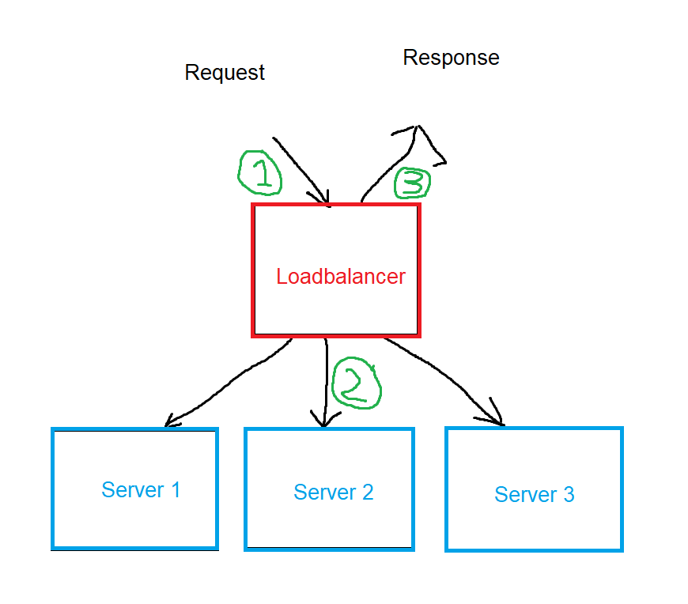

# Algemene beschrijving applicatie
Deze applicatie wordt gemaakt voor het vak NotS-WIN. Dit is een Loadbalancer gemaakt vanuit het TCP-protocol, hierop zal een eigen HTTP-protocol gebouwd worden om zo request op te vangen en door te sturen. Alle netwerkverkeer zal gemonitord worden op de server. Verder zullen er algoritmes toegepast worden die een achterliggende server kunnen selecteren. Tevens worden er ook 2 persistencies toe gepast om de connectie naar de juiste server te sturen (denk hierbij eraan als je bijv. online gaat winkelen).

## Class diagram
Om een beetje inzicht te kunnen krijgen wat de applicatie inhoud is het volgende class diagram opgesteld. Hierin zijn alle classes te zien die gemaakt zijn om tot het eindproduct te komen. Hierin is tevens ook te zien hoe het HTTP protocol is toegepast en hoe het MVVM pattern toegepast is.

## Flowchart
Wat doet de applicatie nou precies? Om dit een beetje te kunnen laten zien is er een flowchart opgesteld. Hierin is te zien dat een request (1) binnenkomt op de loadbalancer en vervolgens dit vervolgens door zal sturen naar een achterliggende server (2). Zodra de achterliggende server een response stuurt, zal dit opgehaald worden door de loadbalancer, eventueel headers toegevoegd worden, en vervolgens weer terug gestuurd worden naar de client (3).

